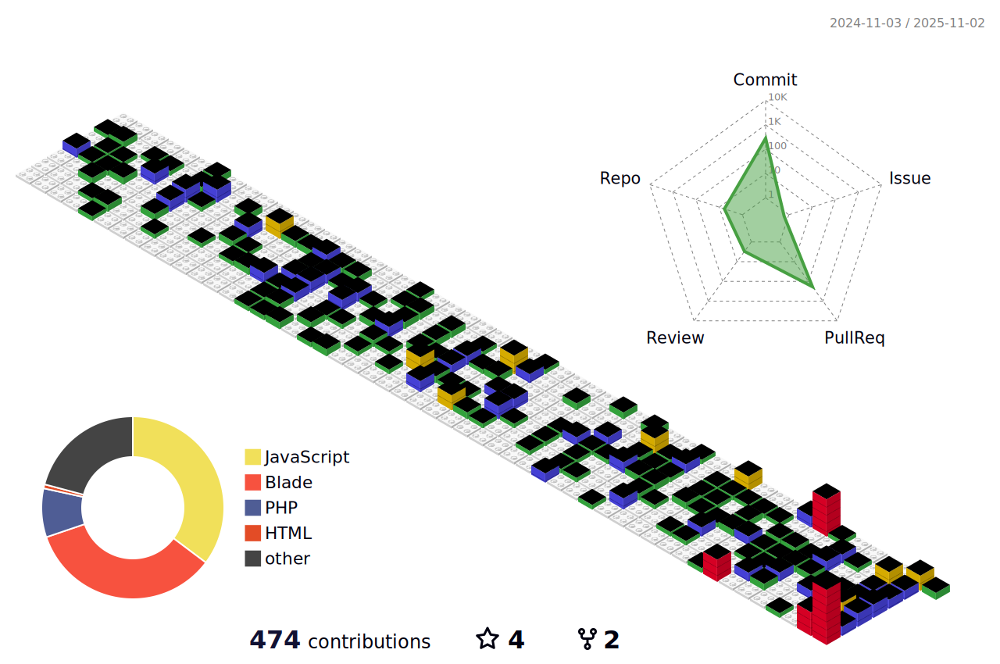
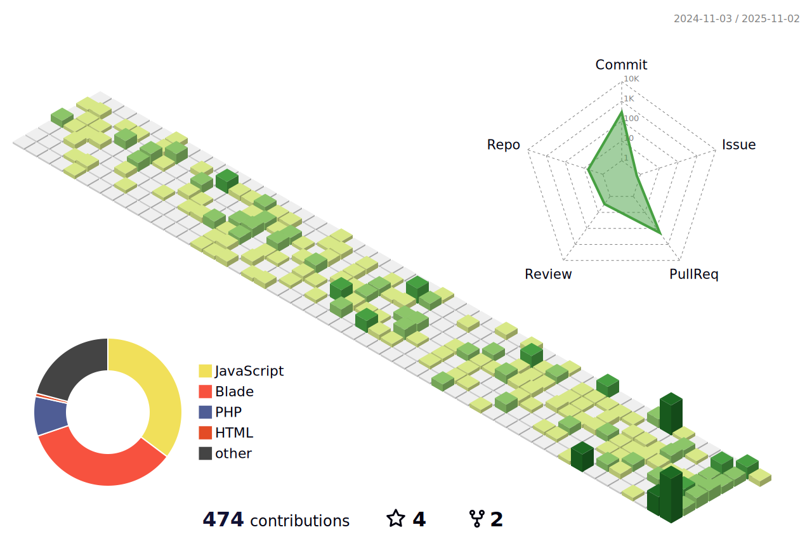
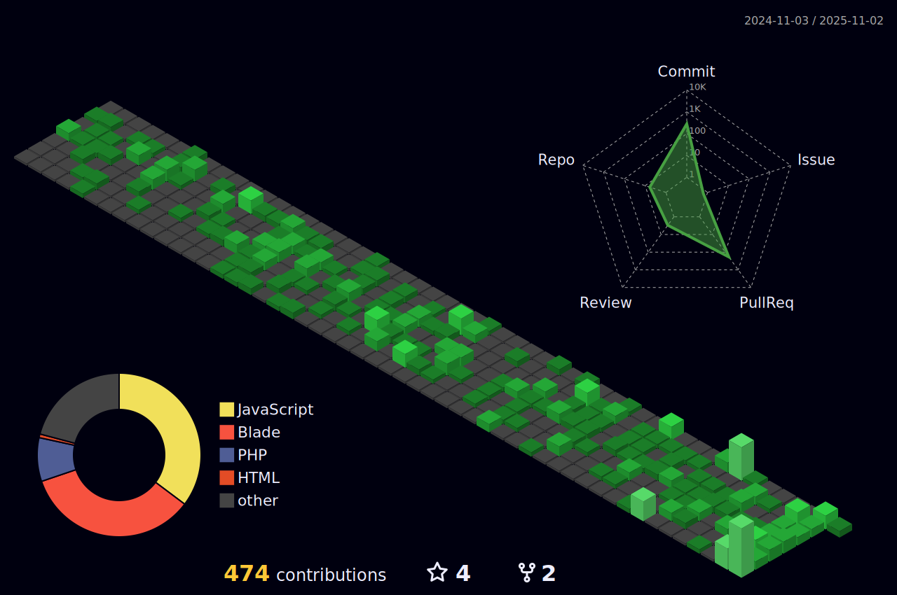
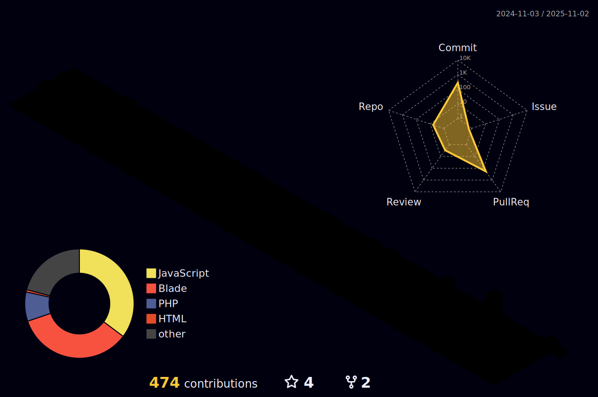
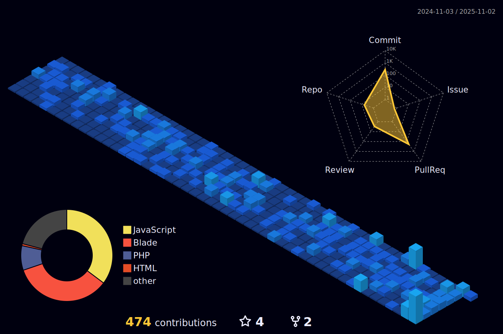
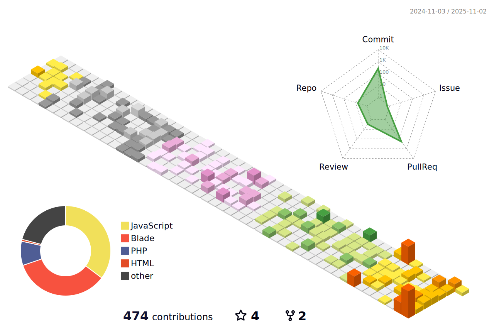
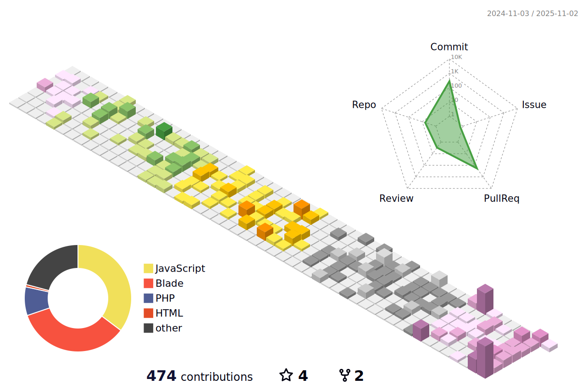

**Software Engineer | Remote**  

---

## ⚔ Tech Stack

### 🗿 Backend

**Proficient with:**  

**Familiar with:**  

)

### 🖼 Frontend

**Proficient with:**  

**Familiar with:**  

### ☁️ DevOps & Tools

## 🏢 Experience

- **Full-Stack Engineer** @ **ICON** *(Aug 2023 – Present)*  
  Built core features using **Node, PHP, React, Next.js, AngularJS, PostgreSQL, Redis, RabbitMQ, AWS, OpenAI**

- **Founding Engineer & Tech Lead** @ **BCRCOMPLY** *(Apr 2022 – Dec 2023)*  
  Architected a **solar energy contract management platform** used by **22+ companies in Ireland**  
  Tech: **Laravel, PHP, MySQL, Redis, Firebase**

- **Senior Software Engineer I** @ **Retailo Technologies** *(Dec 2021 – Aug 2023)*  
  Migrated monolith → **microservices**, delivered features with **Sails.js, Nest.js, Next.js, React Native, AWS**,  
  and implemented **TDD** with 100% API coverage.

- **Software Engineer** @ **Ebryx** *(Apr 2020 – Dec 2021)*  
  Built features for **Invisily (Zero Trust Access)** scaling from 600 → 10,000+ devices.  
  Tech: **Node.js, Express, Angular, RabbitMQ, Redis, MySQL**

- **Full-Stack Engineer** @ **eSketchers** *(Jan 2020 – Apr 2020)*  
  Worked with **Node.js, TypeScript, React, React Native**

- **Freelance Full-Stack Engineer**  
  - **Upwork (Top Rated)** *(2021)* – Full-stack projects with **Node.js, PHP, Laravel, React.js, Python**  
  - **Fiverr (Level 2)** *(2018–2021)* – Delivered solutions with **Node.js, Nest.js, ASP.NET, SQL Server, MongoDB**

## 🎓 Education

- **MS Computer Science** – UET, Lahore *(2025)*  
- **BS Computer Science** – UET, Lahore *(2020)*  

